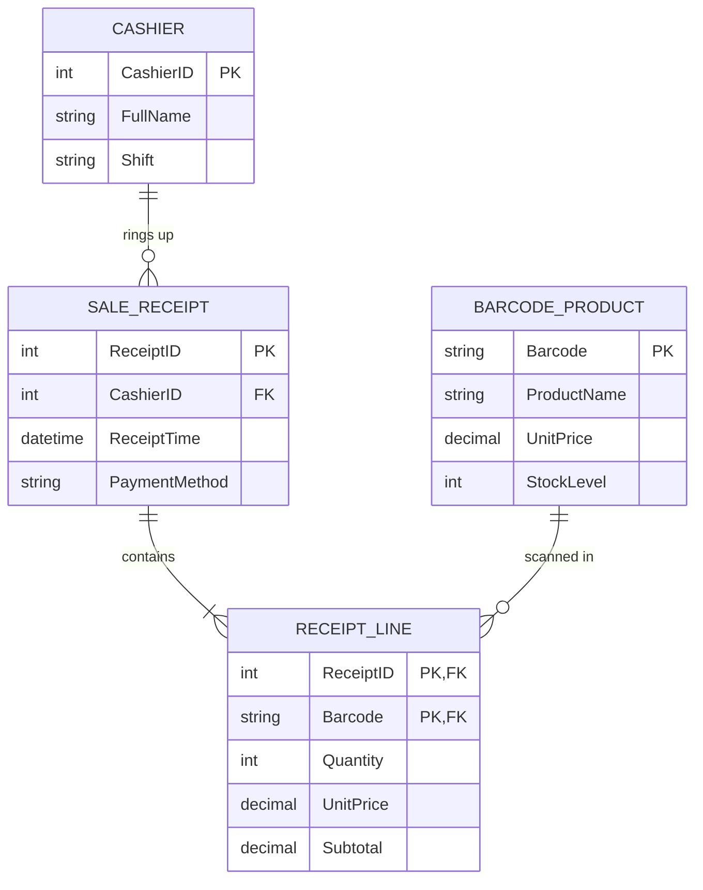

# Educational ERD & Database Correctness Guide: Cardinality, Semantics, and Validation

## Executive Summary

The primary responsibility of an educational ERD and database design application is **DATABASE CORRECTNESS**. The system must prevent students from learning incorrect ERD concepts. A visually beautiful diagram that misrepresents business rules or schema constraints is an educational failure.

This guide codifies the **35 Core Principles of Relational Correctness**, the bidirectional reading methodology, the 3-point triangulation model (Business Rules $\leftrightarrow$ Cardinality Markers $\leftrightarrow$ Schema Constraints), the Cashier–Receipt–Line–Barcode case study, and the automated `ERD_VALIDATION()` inspection pipeline.

---

## 1. Core Principle: Business Rules Over Visual Appearance

**Never determine cardinality from visual appearance.**
Never assume a relationship is correct merely because:
- The line connects two entities
- The relationship name sounds plausible
- A "1" and "N" appear somewhere on the line
- A foreign key column exists in the table
- The diagram looks symmetrical or balanced
- The diagram resembles a familiar CRUD database

### The 12 Pre-Render Questions
Before rendering or validating any relationship between Entity A and Entity B, the system must answer:
1. **What does ONE record in Entity A represent?** (e.g. "One individual cashier").
2. **What does ONE record in Entity B represent?** (e.g. "One completed sale receipt").
3. **How many B records can be associated with ONE A?** (e.g. "One cashier can process *many* receipts").
4. **How many A records can be associated with ONE B?** (e.g. "Each receipt is processed by *one* cashier").
5. **Is the relationship mandatory or optional?** (e.g. A cashier can exist with 0 receipts; a receipt must have 1 cashier).
6. **Which entity owns the foreign key?** (`SALE_RECEIPT.CashierID` points to `CASHIER.CashierID`).
7. **Is this actually a many-to-many relationship?**
8. **If many-to-many, is an associative (junction) entity required?**
9. **Does the associative entity have its own attributes?** (e.g. `Quantity`, `UnitPrice`, `Subtotal`).
10. **Is a composite primary key appropriate?** (e.g. `(ReceiptID, Barcode)`).
11. **Are there temporal or business rules that affect cardinality?**
12. **Is the displayed cardinality consistent with the foreign-key structure?**

---

## 2. Cardinality Must Be Read from Both Sides

For every relationship between Entity A and Entity B, cardinality must be stored and evaluated as two directional bounds:

$$\text{Entity A} \xrightarrow{\text{associates with}} \text{Entity B}: [\min_B, \max_B]$$
$$\text{Entity B} \xrightarrow{\text{associates with}} \text{Entity A}: [\min_A, \max_A]$$

### Example: `CUSTOMER` and `ORDER`
$$\text{CUSTOMER} \rightarrow \text{ORDER}: [0, N]$$
$$\text{ORDER} \rightarrow \text{CUSTOMER}: [1, 1]$$

- **Read Left-to-Right**: One Customer can place zero or many Orders.
- **Read Right-to-Left**: Each Order belongs to exactly one Customer.
- **Common Student Error**: Assuming "1:N" means one customer has one order, or one order has many customers. The system must explicitly bind each marker to its owning entity endpoint.

---

## 3. Unambiguous Endpoint Placement

Cardinality markers must visually attach directly to their corresponding entity endpoints.

```text
INCORRECT (Ambiguous Middle Placement):
ENTITY A ----------- 1 -------- N -------- ENTITY B
(Unclear which number belongs to which entity)

CORRECT (Explicit Endpoint Binding):
ENTITY A [1] (1..1) ─────────── [N] (0..N) ENTITY B
```

- **Endpoint Anchor**: The `[1]` marker belongs strictly to Entity A; the `[N]` marker belongs strictly to Entity B.
- **Crow's Foot Standard**: If crow's foot notation is used, the ring/dash/crow's foot must physically touch the border of the target entity.
- **Directional Center Chip**: The relationship label in the center must explicitly show the directional verb:
  $$\text{CASHIER } [1] \xrightarrow{\quad \text{rings\_up} \quad} [N] \text{ SALE\_RECEIPT}$$

---

## 4. Screenshot-Specific Error Pattern: Point of Sale (POS)

Consider the retail supermarket POS system:
- `CASHIER`
- `SALE_RECEIPT`
- `RECEIPT_LINE`
- `BARCODE_PRODUCT`

### 4.1 `CASHIER` $\rightarrow$ `SALE_RECEIPT`
- **Business Meaning**: A cashier processes many sale receipts over a shift. Each sale receipt is issued by exactly one cashier.
- **Cardinality**: `CASHIER [1]` $\longleftrightarrow$ `[N] SALE_RECEIPT`.
- **Schema Implementation**: `SALE_RECEIPT.CashierID` (FK referencing `CASHIER.CashierID`).
- **Student Error Pattern**: Displaying `CASHIER [1] ──── [1] SALE_RECEIPT`.
  - **Verdict**: **CRITICAL ERROR**. This asserts a cashier can only ever ring up one receipt in their entire career.

### 4.2 `SALE_RECEIPT` $\rightarrow$ `RECEIPT_LINE`
- **Business Meaning**: A sale receipt contains one or more receipt lines. Each receipt line belongs to exactly one receipt.
- **Cardinality**: `SALE_RECEIPT [1]` $\longleftrightarrow$ `[N] RECEIPT_LINE`.
- **Schema Implementation**: `RECEIPT_LINE.ReceiptID` (FK referencing `SALE_RECEIPT.ReceiptID`).
- **Visual Verification**: The `[N]` marker must be attached to `RECEIPT_LINE`. It must never be attached to `SALE_RECEIPT`.

### 4.3 `BARCODE_PRODUCT` $\rightarrow$ `RECEIPT_LINE`
- **Business Meaning**: One product can appear on many receipt lines across different customer carts. Each receipt line refers to one product barcode.
- **Cardinality**: `BARCODE_PRODUCT [1]` $\longleftrightarrow$ `[N] RECEIPT_LINE` (or `RECEIPT_LINE [N]` $\longleftrightarrow$ `[1] BARCODE_PRODUCT`).
- **Schema Implementation**: `RECEIPT_LINE.Barcode` (FK referencing `BARCODE_PRODUCT.Barcode`).
- **Traversals**: Both directions describe the exact same relationship. The table containing the FK (`RECEIPT_LINE`) is the "Many" side.



---

## 5. The 3-Way Triangulation Check

Cardinality must never be validated using only one source. The engine runs a **Triangulation Check** combining three independent sources:

```text
               [ CHECK A ]
             Business Rules
             /            \
            /              \
    [ CHECK B ] ──────── [ CHECK C ]
Diagram Cardinality    Schema Structure (FK, PK, UNIQUE)
```

1. **Check A (Business Statement)**: "Each order is placed by one customer; a customer may place multiple orders."
2. **Check B (Diagram Cardinality)**: `CUSTOMER [1]` $\longleftrightarrow$ `[N] ORDER`.
3. **Check C (Schema Structure)**: `ORDER.CustomerID` is a non-unique foreign key pointing to `CUSTOMER.CustomerID`.
- **Validation**: All three must agree.
- **Anomaly Detection**: If `ORDER.CustomerID` is marked `UNIQUE`, Check C implies a $1:1$ relationship. The engine flags:
  > *"Schema constraint UNIQUE on CustomerID restricts customers to a single order. Contradicts business rule allowing multiple orders."*

---

## 6. Direction Test & Reverse-Read Test

For every relationship, the application automatically synthesizes two natural-language sentences:

### Forward Statement (Left to Right)
$$\text{"One [Source] can [verb] [many / at most one] [Target] records."}$$

### Reverse Statement (Right to Left)
$$\text{"Each [Target] is [verb passive / belongs to] [one / many] [Source] records."}$$

### Example: Cashier & Sale Receipt
- **Forward**: "One cashier can process many sale receipts." $\rightarrow$ **TRUE**
- **Reverse**: "Each sale receipt is processed by one cashier." $\rightarrow$ **TRUE**
- **Evaluation**: Both statements are true $\implies$ Cardinality is **$1:N$**. If either statement is false, the diagram is rejected.

---

## 7. Associative Entity & Primary Key Rules

### The "One Row = One Thing" Test
Before assigning keys, explicitly complete this sentence:
$$\text{"One row in this table represents \_\_\_\_\_\_\_\_."}$$

- `CASHIER`: One row represents one registered register cashier.
- `SALE_RECEIPT`: One row represents one checkout transaction.
- `RECEIPT_LINE`: One row represents one product barcode scanned inside a specific receipt.

### Surrogate Keys vs. Natural Composite Keys
- **Default for Junctions**: When a product occurs at most once per receipt, `(ReceiptID, Barcode)` naturally forms a valid composite primary key.
- **Explicit Surrogate Exception**: If the business requirements explicitly specify `LineItemID`, use `LineItemID` as PK and mark `(ReceiptID, Barcode)` with a `UNIQUE` constraint.
- **Anti-Pattern**: Never teach students that "every table must have an auto-increment ID". Candidate keys must be derived from data semantics.

---

## 8. Automated `ERD_VALIDATION()` Specification

Before presenting any ERD as complete or correct, the system executes `ERD_VALIDATION()`:

### Verification Checklist
- [x] Every entity has a clear purpose and meaningful name.
- [x] Every attribute belongs to the correct entity.
- [x] Every entity has a designated primary key (single or composite).
- [x] Every foreign key references an existing PK or candidate key.
- [x] Cardinality matches the business requirements.
- [x] Cardinality markers are visually bound to the correct endpoints.
- [x] Optionality (minimum cardinality: 0 vs 1) is verified.
- [x] Many-to-Many relationships are decomposed via associative bridge tables.
- [x] Foreign key placement matches the "many" side in $1:N$ relationships.
- [x] No relationship lines cross unnecessarily or pass through entity nodes.
- [x] Relationship verb labels are meaningful (no generic "has" or "connected to").

### Error Classification
- **CRITICAL**:
  - Wrong cardinality (e.g. $1:1$ instead of $1:N$).
  - Inverted relationship direction (attaching $N$ to the parent).
  - Missing or malformed Foreign Key.
  - Direct $M:N$ relationship in a relational implementation.
  - Business rule violation.
- **MAJOR**:
  - Incorrect optionality ($0..1$ vs $1..1$).
  - Unnecessary surrogate key on pure junction.
  - Missing relationship-specific attribute.
- **MINOR**:
  - Generic verb label ("has").
  - Poor line routing or visual overlap.

---

## 9. Standard ERD Validation Report Format

When reporting validation results to students, the application outputs:

```text
-----------------------------------------
ERD VALIDATION RESULT
-----------------------------------------
Overall Status: FAIL
Critical Errors: 1
Major Errors: 0
Minor Errors: 1

-----------------------------------------
RELATIONSHIP CHECK
-----------------------------------------
Relationship:
CASHIER -> SALE_RECEIPT

Expected:
CASHIER [1] (0..N) ─────────── [N] (1..1) SALE_RECEIPT

Rendered:
CASHIER [1] ─────────────────── [1] SALE_RECEIPT

Status:
FAIL (CRITICAL)

Reason:
One cashier can process many sales receipts over their shift.
Rendering this as 1:1 restricts each cashier to exactly one receipt forever.

-----------------------------------------
SCHEMA CHECK
-----------------------------------------
Foreign Key Placement:
PASS (SALE_RECEIPT.CashierID -> CASHIER.CashierID)

Uniqueness Constraint:
PASS (CashierID in SALE_RECEIPT is NOT unique, supporting 1:N)

Cardinality Consistency:
FAIL (Diagram displays 1:1, but schema and business rules dictate 1:N)

-----------------------------------------
VISUAL CHECK
-----------------------------------------
Cardinality Marker Placement: PASS (Attached to endpoints)
Line Crossing: PASS (Orthogonal routing)
Label Ambiguity: MINOR (Verb 'has' should be 'rings up' or 'processes')

-----------------------------------------
CORRECTED MODEL
-----------------------------------------
CASHIER [1] (0..N) ─────── rings_up ───────► [N] (1..1) SALE_RECEIPT

Reasoning:
A Cashier can exist without receipts (0..N).
A Sale Receipt must be processed by exactly one Cashier (1..1).
The Foreign Key CashierID resides on the 'many' side (SALE_RECEIPT).
```

---

## 10. Educational Rules of Engagement

1. **Do not trust existing diagrams**: Always recalculate cardinalities from business rules rather than assuming the current canvas state is authoritative.
2. **Never teach visual shortcuts**:
   - Do NOT teach: *"The FK side is always the many side."*
   - Teach: *"Usually, a non-unique foreign key represents the many side, but cardinality must be confirmed using business rules and unique constraints."*
3. **Separation of Concerns**:
   - **Logical Model**: Entities, attributes, PKs, FKs, cardinalities, optionalities.
   - **Visual Model**: Coordinates, orthogonal line routes, endpoint chips, label anchors.
   - **The database model dictates the diagram; the diagram never dictates the database model.**
