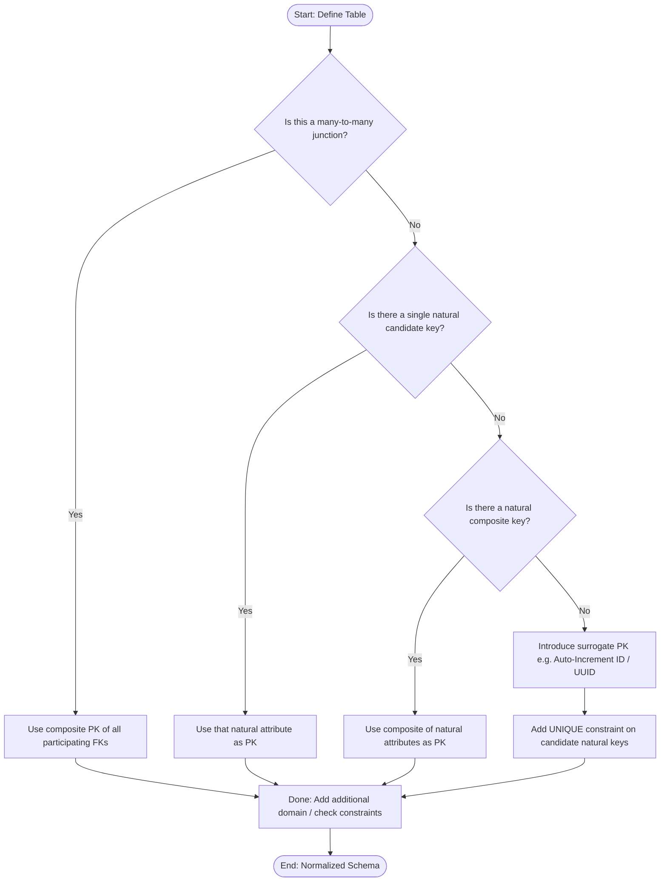
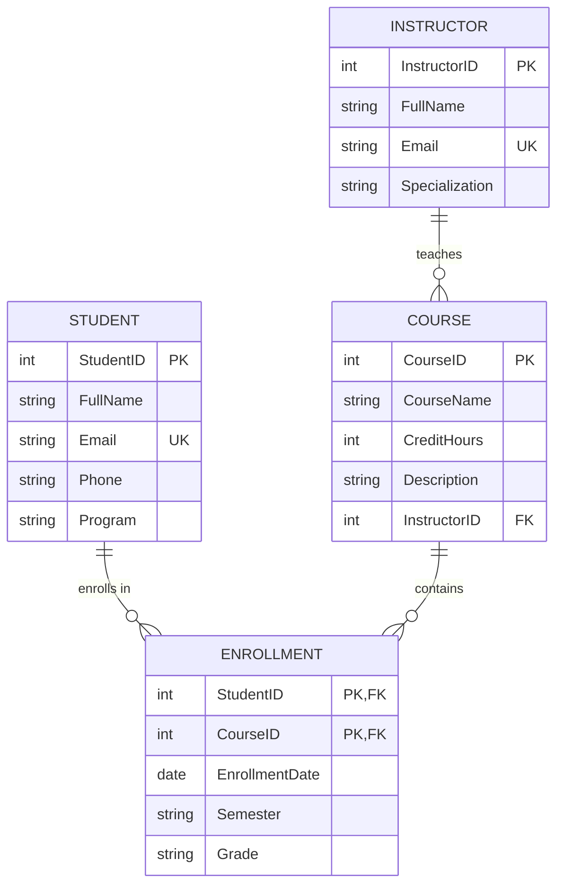
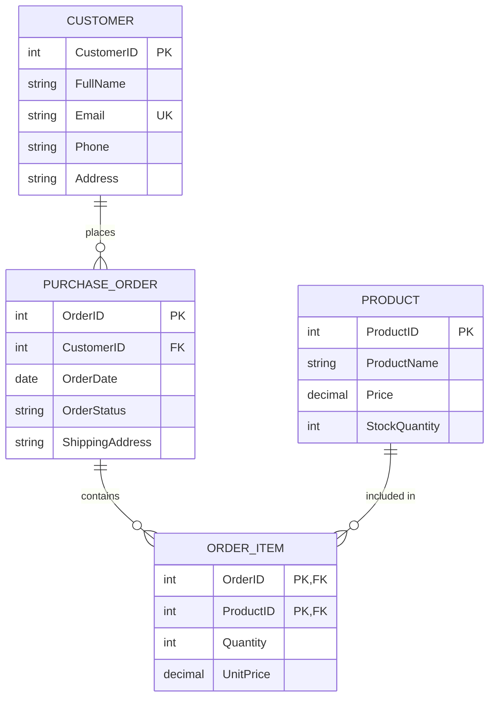
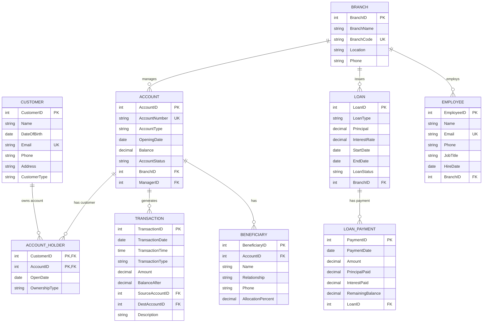
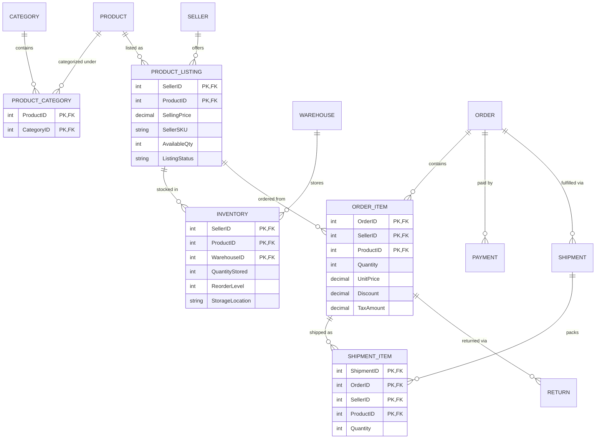
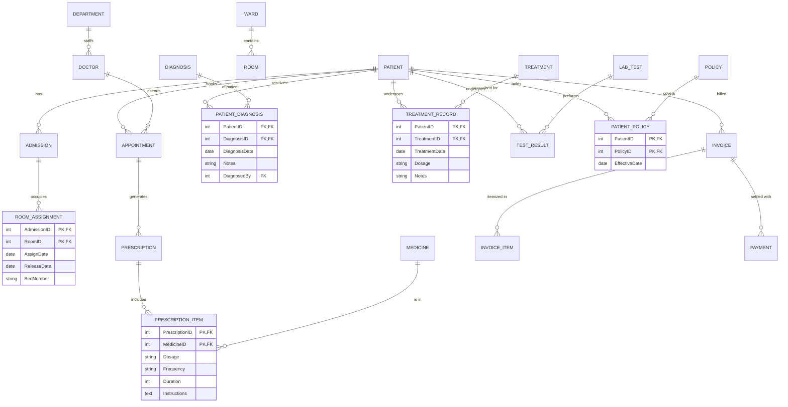

# Relational Schema & ERD Design Guide: Primary Key Strategy & Solutions

## Executive Summary

This document provides a comprehensive set of guidelines, prompts, and solutions for designing relational schemas and Entity-Relationship Diagrams (ERDs), with a focus on primary key (PK) strategy.

### Key Takeaways
- **Primary Key Strategy**: Business rules and table purpose dictate keys. If a table is an associative/junction table (resolving an $M:N$ relationship), the combination of its foreign keys forms a **composite primary key** by default. Do not add an arbitrary surrogate ID unless there is a clear justification (e.g. the junction table itself is referenced as a parent by other tables). For regular entity tables, prefer natural or composite keys if they naturally ensure uniqueness; use surrogate keys (auto-increment IDs, UUIDs, etc.) only when no stable natural key exists or to simplify very wide or frequently changing key structures.
- **Validation and Testing**: Every schema comes with a checklist and test cases to verify uniqueness and integrity (e.g., attempting duplicate key insertions to confirm primary key constraints). Sample ANSI SQL DDL and seed data are provided for each scenario.
- **Exercises Q6–Q10**:
  - **Q6**: University Course Enrollment (composite PK `(StudentID, CourseID)`)
  - **Q7**: E-Commerce Order & Order Items (composite PK `(OrderID, ProductID)`)
  - **Q8**: Banking Management System (M:N joint account holders `(CustomerID, AccountID)`, loans, transactions, beneficiaries)
  - **Q9**: E-Commerce Marketplace (listings `(SellerID, ProductID)`, multi-seller order items `(OrderID, SellerID, ProductID)`, warehouse inventory `(SellerID, ProductID, WarehouseID)`, split shipments `(ShipmentID, OrderID, SellerID, ProductID)`)
  - **Q10**: Hospital & Healthcare Management (room assignments `(AdmissionID, RoomID)`, patient diagnoses `(PatientID, DiagnosisID)`, treatment records `(PatientID, TreatmentID)`, prescription items `(PrescriptionID, MedicineID)`, patient policies `(PatientID, PolicyID)`)
- **Advanced Case Studies**: Schemas normalized to 3NF, indexing recommendations, and tradeoffs between surrogate keys and composite keys.
- **Markdown QA Guidelines**: Rules to prevent raw Markdown artifacts (`**`, `###`, unrendered backticks) in UI outputs.
- **Academic Grounding**: Based on relational database standards (C.J. Date, Elmasri & Navathe, Kimball, ANSI SQL).

---

## 1. System Prompt: Primary Key Decision Flow

### Goal
Provide AI systems and relational engineers with a clear, step-by-step policy for choosing primary keys. The prompt enforces checking business rules and the natural uniqueness of attributes before resorting to surrogate IDs.

### Primary Key Strategy Prompt
```text
You are a database design assistant. For each table, determine the primary key as follows:

1. Identify the table type (entity vs associative/junction):
   - If it is an associative (junction) table resolving a many-to-many relationship
     between two (or more) entities, the foreign key columns from the related tables
     form the composite primary key. Do NOT add a separate ID column unless absolutely
     required by a higher-level need (such as referencing this table from other tables).
     The composite of FKs itself uniquely identifies the relationship.
   - Otherwise (an entity table), proceed to find a unique key.

2. Look for natural candidate keys:
   - List attributes that uniquely identify each row (e.g. registration numbers,
     codes, or meaningful fields).
   - If a single attribute qualifies, use it as the primary key.
   - If no single attribute works, check if multiple attributes together uniquely
     identify the entity. If yes, use those as a composite primary key.

3. Surrogate key decision:
   - Use a surrogate (artificial) key only if there is no natural key (or composite)
     that fulfills uniqueness and stability requirements. Justify its use:
       * "No stable natural key exists"
       * "The composite natural key is very wide or frequently changes"
   - Always enforce any natural uniqueness as a UNIQUE constraint in addition to
     any surrogate PK to preserve data integrity.
   - Hard Constraint: Never add a separate ID (surrogate) to a junction table by
     default. First assume (FK1, FK2, ...) is the PK. Use a surrogate ID in a junction
     only if that relationship row needs its own ID for other references.

4. Self-Check Questions (for each table):
   - What does one row represent?
   - Which attributes make a row unique (candidate keys)?
   - Is this an associative table (M:N)?
   - If M:N, can the foreign keys alone form a unique combination?
   - If an entity table, is there a single natural key or a natural composite key?
   - If not, what surrogate ID might be needed, and why?
   - If using a surrogate, have I added a UNIQUE constraint on the natural candidate keys?
```

### Decision Flowchart


---

## 2. Instructor Solutions: Lab Questions Q6–Q10

### Q6: University Course Enrollment

#### Scenario
Students enroll in courses; instructors teach courses. Each student can take many courses and each course can have many students (a student can enroll in a given course only once). Each course is taught by one instructor. Enrollment records a date, semester, and grade.

#### ERD Specification


#### SQL DDL
```sql
CREATE TABLE Student (
    StudentID    INT PRIMARY KEY,
    FullName     VARCHAR(100) NOT NULL,
    Email        VARCHAR(100) NOT NULL UNIQUE,
    Phone        VARCHAR(20),
    Program      VARCHAR(50)
);

CREATE TABLE Instructor (
    InstructorID INT PRIMARY KEY,
    FullName     VARCHAR(100) NOT NULL,
    Email        VARCHAR(100) NOT NULL UNIQUE,
    Specialization VARCHAR(50)
);

CREATE TABLE Course (
    CourseID     INT PRIMARY KEY,
    CourseName   VARCHAR(100) NOT NULL,
    CreditHours  INT NOT NULL CHECK (CreditHours > 0),
    Description  TEXT,
    InstructorID INT NOT NULL,
    FOREIGN KEY (InstructorID) REFERENCES Instructor(InstructorID)
);

CREATE TABLE Enrollment (
    StudentID      INT NOT NULL,
    CourseID       INT NOT NULL,
    EnrollmentDate DATE NOT NULL,
    Semester       VARCHAR(10) NOT NULL,
    Grade          CHAR(2),
    PRIMARY KEY (StudentID, CourseID),
    FOREIGN KEY (StudentID) REFERENCES Student(StudentID) ON DELETE CASCADE,
    FOREIGN KEY (CourseID)  REFERENCES Course(CourseID) ON DELETE RESTRICT
);
```

#### Primary Key Justification
- `Student`, `Instructor`, `Course`: Primary identifiers (`StudentID`, `InstructorID`, `CourseID`) serve as compact, immutable keys.
- `Enrollment`: Resolves the $M:N$ relationship between `Student` and `Course`. Under the business rule that a student may enroll in a given course only once, `(StudentID, CourseID)` is naturally unique. Adding a surrogate `EnrollmentID` is redundant and unnecessary.

#### Validation Checklist & Test Queries
1. **Duplicate Enrollment Rejection:**
   ```sql
   INSERT INTO Enrollment (StudentID, CourseID, EnrollmentDate, Semester, Grade)
   VALUES (1, 101, '2026-01-15', 'Spring2026', 'A');

   -- Attempt duplicate insertion (MUST FAIL with PK violation):
   INSERT INTO Enrollment (StudentID, CourseID, EnrollmentDate, Semester, Grade)
   VALUES (1, 101, '2026-01-16', 'Spring2026', 'B');
   ```
2. **Referential Integrity Enforcement:**
   ```sql
   -- Inserting non-existent StudentID (MUST FAIL with FK constraint violation):
   INSERT INTO Enrollment (StudentID, CourseID, EnrollmentDate, Semester, Grade)
   VALUES (999, 101, '2026-01-15', 'Spring2026', 'A');
   ```

---

### Q7: E-Commerce Order & Composite Keys

#### Scenario
An online shopping schema with Customers, Products, Orders, and OrderItems. Each order can contain many products (each product at most once per order). OrderItem records quantity and unit price at time of purchase.

#### ERD Specification


#### SQL DDL
```sql
CREATE TABLE Customer (
    CustomerID INT PRIMARY KEY,
    FullName   VARCHAR(100) NOT NULL,
    Email      VARCHAR(100) NOT NULL UNIQUE,
    Phone      VARCHAR(20),
    Address    VARCHAR(200)
);

CREATE TABLE Product (
    ProductID     INT PRIMARY KEY,
    ProductName   VARCHAR(100) NOT NULL,
    Price         DECIMAL(10,2) NOT NULL CHECK (Price >= 0),
    StockQuantity INT NOT NULL CHECK (StockQuantity >= 0)
);

CREATE TABLE PurchaseOrder (
    OrderID         INT PRIMARY KEY,
    CustomerID      INT NOT NULL,
    OrderDate       DATE NOT NULL,
    OrderStatus     VARCHAR(20) NOT NULL,
    ShippingAddress VARCHAR(200) NOT NULL,
    FOREIGN KEY (CustomerID) REFERENCES Customer(CustomerID)
);

CREATE TABLE OrderItem (
    OrderID   INT NOT NULL,
    ProductID INT NOT NULL,
    Quantity  INT NOT NULL CHECK (Quantity > 0),
    UnitPrice DECIMAL(10,2) NOT NULL CHECK (UnitPrice >= 0),
    PRIMARY KEY (OrderID, ProductID),
    FOREIGN KEY (OrderID) REFERENCES PurchaseOrder(OrderID) ON DELETE CASCADE,
    FOREIGN KEY (ProductID) REFERENCES Product(ProductID)
);
```

#### Primary Key Justification
- `OrderItem` explicitly models a line item where a product occurs at most once per order. The quantity attribute tracks multiple units.
- Therefore, `(OrderID, ProductID)` is completely unique. Creating an artificial `OrderItemID` would introduce an unnecessary surrogate column and require an auxiliary `UNIQUE(OrderID, ProductID)` constraint to prevent duplicate line items.

#### Validation Checklist & Test Queries
```sql
INSERT INTO PurchaseOrder (OrderID, CustomerID, OrderDate, OrderStatus, ShippingAddress)
VALUES (5001, 1001, '2026-08-01', 'Pending', '123 Main St');

INSERT INTO OrderItem (OrderID, ProductID, Quantity, UnitPrice)
VALUES (5001, 200, 3, 49.99);

-- Duplicate product in same order (MUST FAIL):
INSERT INTO OrderItem (OrderID, ProductID, Quantity, UnitPrice)
VALUES (5001, 200, 2, 49.99);
```

---

### Q8: Banking Management System

#### Scenario
A commercial bank database covering customers, branches, employees, accounts, account-holders (many-to-many relationship supporting joint accounts), transactions (with transfers between accounts), loans, loan payments, and beneficiaries.

#### ERD Specification


#### SQL DDL
```sql
CREATE TABLE Customer (
    CustomerID   INT PRIMARY KEY,
    Name         VARCHAR(100) NOT NULL,
    DateOfBirth  DATE NOT NULL,
    Email        VARCHAR(100) NOT NULL UNIQUE,
    Phone        VARCHAR(20),
    Address      VARCHAR(200),
    CustomerType VARCHAR(20) NOT NULL
);

CREATE TABLE Branch (
    BranchID   INT PRIMARY KEY,
    BranchName VARCHAR(100) NOT NULL,
    BranchCode VARCHAR(10) NOT NULL UNIQUE,
    Location   VARCHAR(100) NOT NULL,
    Phone      VARCHAR(20)
);

CREATE TABLE Employee (
    EmployeeID INT PRIMARY KEY,
    Name       VARCHAR(100) NOT NULL,
    Email      VARCHAR(100) NOT NULL UNIQUE,
    Phone      VARCHAR(20),
    JobTitle   VARCHAR(50) NOT NULL,
    HireDate   DATE NOT NULL,
    BranchID   INT NOT NULL,
    FOREIGN KEY (BranchID) REFERENCES Branch(BranchID)
);

CREATE TABLE Account (
    AccountID     INT PRIMARY KEY,
    AccountNumber VARCHAR(20) NOT NULL UNIQUE,
    AccountType   VARCHAR(20) NOT NULL,
    OpeningDate   DATE NOT NULL,
    Balance       DECIMAL(15,2) NOT NULL CHECK (Balance >= 0),
    AccountStatus VARCHAR(20) NOT NULL,
    BranchID      INT NOT NULL,
    ManagerID     INT,
    FOREIGN KEY (BranchID) REFERENCES Branch(BranchID),
    FOREIGN KEY (ManagerID) REFERENCES Employee(EmployeeID)
);

CREATE TABLE Account_Holder (
    CustomerID    INT NOT NULL,
    AccountID     INT NOT NULL,
    OpenDate      DATE NOT NULL,
    OwnershipType VARCHAR(20) NOT NULL,
    PRIMARY KEY (CustomerID, AccountID),
    FOREIGN KEY (CustomerID) REFERENCES Customer(CustomerID),
    FOREIGN KEY (AccountID)  REFERENCES Account(AccountID)
);

CREATE TABLE Transaction (
    TransactionID   INT PRIMARY KEY,
    TransactionDate DATE NOT NULL,
    TransactionTime TIME NOT NULL,
    TransactionType VARCHAR(20) NOT NULL,
    Amount          DECIMAL(15,2) NOT NULL CHECK (Amount > 0),
    BalanceAfter    DECIMAL(15,2) NOT NULL,
    SourceAccountID INT NOT NULL,
    DestAccountID   INT,
    Description     VARCHAR(200),
    FOREIGN KEY (SourceAccountID) REFERENCES Account(AccountID),
    FOREIGN KEY (DestAccountID)   REFERENCES Account(AccountID)
);

CREATE TABLE Loan (
    LoanID       INT PRIMARY KEY,
    LoanType     VARCHAR(20) NOT NULL,
    Principal    DECIMAL(15,2) NOT NULL CHECK (Principal > 0),
    InterestRate DECIMAL(5,2) NOT NULL CHECK (InterestRate >= 0),
    StartDate    DATE NOT NULL,
    EndDate      DATE NOT NULL,
    LoanStatus   VARCHAR(20) NOT NULL,
    BranchID     INT NOT NULL,
    FOREIGN KEY (BranchID) REFERENCES Branch(BranchID)
);

CREATE TABLE Loan_Payment (
    PaymentID        INT PRIMARY KEY,
    PaymentDate      DATE NOT NULL,
    Amount           DECIMAL(15,2) NOT NULL CHECK (Amount > 0),
    PrincipalPaid    DECIMAL(15,2) NOT NULL,
    InterestPaid     DECIMAL(15,2) NOT NULL,
    RemainingBalance DECIMAL(15,2) NOT NULL,
    LoanID           INT NOT NULL,
    FOREIGN KEY (LoanID) REFERENCES Loan(LoanID)
);

CREATE TABLE Beneficiary (
    BeneficiaryID     INT PRIMARY KEY,
    AccountID         INT NOT NULL,
    Name              VARCHAR(100) NOT NULL,
    Relationship      VARCHAR(20),
    Phone             VARCHAR(20),
    AllocationPercent DECIMAL(5,2) NOT NULL CHECK (AllocationPercent > 0 AND AllocationPercent <= 100),
    FOREIGN KEY (AccountID) REFERENCES Account(AccountID)
);
```

#### Key Architecture & Justification
- `Account_Holder`: Pure associative table resolving $M:N$ ownership (a customer owns multiple accounts; an account can have joint co-owners). `(CustomerID, AccountID)` forms the composite PK.
- `Transaction`: Represents chronological monetary events. Multiple transactions can occur between the same accounts on the same day, so an artificial `TransactionID` is the proper design.
- `Loan_Payment` & `Beneficiary`: Managed with surrogate IDs (`PaymentID`, `BeneficiaryID`) to allow clean referencing and partial allocation tracking.

---

### Q9: E-Commerce Marketplace

#### Scenario
A multi-vendor marketplace (e.g., Amazon) connecting Customers, Sellers, Products, Categories, Listings, Orders, Order Items, Payments, Shipments, Warehouses, Inventory, Reviews, and Returns.

#### Key Challenges & ERD Highlights


#### SQL DDL
```sql
CREATE TABLE Customer (
    CustomerID       INT PRIMARY KEY,
    FullName         VARCHAR(100) NOT NULL,
    Email            VARCHAR(100) NOT NULL UNIQUE,
    Phone            VARCHAR(20),
    Address          VARCHAR(200),
    RegistrationDate DATE NOT NULL
);

CREATE TABLE Seller (
    SellerID         INT PRIMARY KEY,
    BusinessName     VARCHAR(100) NOT NULL,
    Email            VARCHAR(100) NOT NULL UNIQUE,
    Phone            VARCHAR(20),
    Address          VARCHAR(200),
    RegistrationDate DATE NOT NULL,
    Status           VARCHAR(20) NOT NULL
);

CREATE TABLE Product (
    ProductID   INT PRIMARY KEY,
    ProductName VARCHAR(100) NOT NULL,
    Description TEXT,
    Brand       VARCHAR(50),
    ModelNumber VARCHAR(50)
);

CREATE TABLE Category (
    CategoryID   INT PRIMARY KEY,
    CategoryName VARCHAR(100) NOT NULL,
    Description  TEXT
);

CREATE TABLE Product_Category (
    ProductID  INT NOT NULL,
    CategoryID INT NOT NULL,
    PRIMARY KEY (ProductID, CategoryID),
    FOREIGN KEY (ProductID) REFERENCES Product(ProductID),
    FOREIGN KEY (CategoryID) REFERENCES Category(CategoryID)
);

CREATE TABLE Product_Listing (
    SellerID      INT NOT NULL,
    ProductID     INT NOT NULL,
    SellingPrice  DECIMAL(10,2) NOT NULL CHECK (SellingPrice >= 0),
    SellerSKU     VARCHAR(50),
    AvailableQty  INT NOT NULL CHECK (AvailableQty >= 0),
    ListingStatus VARCHAR(20) NOT NULL,
    ListingDate   DATE NOT NULL,
    PRIMARY KEY (SellerID, ProductID),
    FOREIGN KEY (SellerID) REFERENCES Seller(SellerID),
    FOREIGN KEY (ProductID) REFERENCES Product(ProductID)
);

CREATE TABLE Warehouse (
    WarehouseID   INT PRIMARY KEY,
    WarehouseName VARCHAR(100) NOT NULL,
    Location      VARCHAR(100) NOT NULL,
    Capacity      INT NOT NULL CHECK (Capacity > 0)
);

CREATE TABLE Inventory (
    SellerID        INT NOT NULL,
    ProductID       INT NOT NULL,
    WarehouseID     INT NOT NULL,
    QuantityStored  INT NOT NULL CHECK (QuantityStored >= 0),
    ReorderLevel    INT DEFAULT 10,
    StorageLocation VARCHAR(100),
    PRIMARY KEY (SellerID, ProductID, WarehouseID),
    FOREIGN KEY (SellerID, ProductID) REFERENCES Product_Listing(SellerID, ProductID),
    FOREIGN KEY (WarehouseID) REFERENCES Warehouse(WarehouseID)
);

CREATE TABLE "Order" (
    OrderID         INT PRIMARY KEY,
    CustomerID      INT NOT NULL,
    OrderDate       DATE NOT NULL,
    OrderStatus     VARCHAR(20) NOT NULL,
    ShippingAddress VARCHAR(200) NOT NULL,
    TotalAmount     DECIMAL(12,2) NOT NULL CHECK (TotalAmount >= 0),
    FOREIGN KEY (CustomerID) REFERENCES Customer(CustomerID)
);

CREATE TABLE Order_Item (
    OrderID   INT NOT NULL,
    SellerID  INT NOT NULL,
    ProductID INT NOT NULL,
    Quantity  INT NOT NULL CHECK (Quantity > 0),
    UnitPrice DECIMAL(10,2) NOT NULL CHECK (UnitPrice >= 0),
    Discount  DECIMAL(5,2) DEFAULT 0.00,
    TaxAmount DECIMAL(5,2) DEFAULT 0.00,
    PRIMARY KEY (OrderID, SellerID, ProductID),
    FOREIGN KEY (OrderID) REFERENCES "Order"(OrderID) ON DELETE CASCADE,
    FOREIGN KEY (SellerID, ProductID) REFERENCES Product_Listing(SellerID, ProductID)
);

CREATE TABLE Payment (
    PaymentID      INT PRIMARY KEY,
    OrderID        INT NOT NULL,
    PaymentDate    DATE NOT NULL,
    Amount         DECIMAL(12,2) NOT NULL CHECK (Amount > 0),
    Method         VARCHAR(20) NOT NULL,
    TransactionRef VARCHAR(50) NOT NULL UNIQUE,
    PaymentStatus  VARCHAR(20) NOT NULL,
    FOREIGN KEY (OrderID) REFERENCES "Order"(OrderID)
);

CREATE TABLE Shipment (
    ShipmentID     INT PRIMARY KEY,
    OrderID        INT NOT NULL,
    ShipmentDate   DATE NOT NULL,
    Carrier        VARCHAR(50) NOT NULL,
    TrackingNumber VARCHAR(50) NOT NULL UNIQUE,
    ShipmentStatus VARCHAR(20) NOT NULL,
    DeliveryDate   DATE,
    FOREIGN KEY (OrderID) REFERENCES "Order"(OrderID)
);

CREATE TABLE Shipment_Item (
    ShipmentID INT NOT NULL,
    OrderID    INT NOT NULL,
    SellerID   INT NOT NULL,
    ProductID  INT NOT NULL,
    Quantity   INT NOT NULL CHECK (Quantity > 0),
    PRIMARY KEY (ShipmentID, OrderID, SellerID, ProductID),
    FOREIGN KEY (ShipmentID) REFERENCES Shipment(ShipmentID) ON DELETE CASCADE,
    FOREIGN KEY (OrderID, SellerID, ProductID) REFERENCES Order_Item(OrderID, SellerID, ProductID)
);

CREATE TABLE Review (
    ReviewID   INT PRIMARY KEY,
    CustomerID INT NOT NULL,
    ProductID  INT NOT NULL,
    Rating     INT NOT NULL CHECK (Rating BETWEEN 1 AND 5),
    Title      VARCHAR(100),
    ReviewText TEXT,
    ReviewDate DATE NOT NULL,
    UNIQUE (CustomerID, ProductID),
    FOREIGN KEY (CustomerID) REFERENCES Customer(CustomerID),
    FOREIGN KEY (ProductID)  REFERENCES Product(ProductID)
);

CREATE TABLE Return (
    ReturnID     INT PRIMARY KEY,
    OrderID      INT NOT NULL,
    SellerID     INT NOT NULL,
    ProductID    INT NOT NULL,
    ReturnDate   DATE NOT NULL,
    Reason       TEXT NOT NULL,
    ReturnStatus VARCHAR(20) NOT NULL,
    RefundAmount DECIMAL(10,2) NOT NULL CHECK (RefundAmount >= 0),
    FOREIGN KEY (OrderID, SellerID, ProductID) REFERENCES Order_Item(OrderID, SellerID, ProductID)
);
```

#### Key Architecture & Justification
- `Product_Listing`: `(SellerID, ProductID)` is naturally unique because a seller does not create duplicate active listings for the same product.
- `Order_Item`: `(OrderID, SellerID, ProductID)` uniquely links the line item to the exact seller listing purchased.
- `Shipment_Item`: `(ShipmentID, OrderID, SellerID, ProductID)` handles partial fulfillment (split shipments across multiple boxes or warehouses).

---

### Q10: Hospital & Healthcare Management

#### Scenario
An integrated healthcare system spanning Patients, Departments, Doctors, Appointments, Inpatient Admissions, Rooms/Wards, Diagnoses, Treatments, Prescriptions (and prescribed items), Lab Tests/Results, Insurance Policies, Invoices, and Payments.

#### ERD Specification


#### SQL DDL
```sql
CREATE TABLE Patient (
    PatientID        INT PRIMARY KEY,
    FullName         VARCHAR(100) NOT NULL,
    DateOfBirth      DATE NOT NULL,
    Gender           VARCHAR(10) NOT NULL,
    Phone            VARCHAR(20),
    Email            VARCHAR(100) UNIQUE,
    Address          VARCHAR(200),
    EmergencyContact VARCHAR(100)
);

CREATE TABLE Department (
    DepartmentID INT PRIMARY KEY,
    Name         VARCHAR(100) NOT NULL,
    Location     VARCHAR(100),
    Phone        VARCHAR(20)
);

CREATE TABLE Doctor (
    DoctorID       INT PRIMARY KEY,
    FullName       VARCHAR(100) NOT NULL,
    Email          VARCHAR(100) NOT NULL UNIQUE,
    Phone          VARCHAR(20),
    Specialization VARCHAR(50) NOT NULL,
    LicenseNumber  VARCHAR(50) NOT NULL UNIQUE,
    DepartmentID   INT NOT NULL,
    FOREIGN KEY (DepartmentID) REFERENCES Department(DepartmentID)
);

CREATE TABLE Appointment (
    AppointmentID INT PRIMARY KEY,
    ApptDate      DATE NOT NULL,
    ApptTime      TIME NOT NULL,
    Status        VARCHAR(20) NOT NULL,
    Reason        VARCHAR(200),
    PatientID     INT NOT NULL,
    DoctorID      INT NOT NULL,
    FOREIGN KEY (PatientID) REFERENCES Patient(PatientID),
    FOREIGN KEY (DoctorID)  REFERENCES Doctor(DoctorID)
);

CREATE TABLE Admission (
    AdmissionID   INT PRIMARY KEY,
    AdmissionDate DATE NOT NULL,
    DischargeDate DATE,
    Reason        VARCHAR(200) NOT NULL,
    Status        VARCHAR(20) NOT NULL,
    PatientID     INT NOT NULL,
    FOREIGN KEY (PatientID) REFERENCES Patient(PatientID)
);

CREATE TABLE Ward (
    WardID   INT PRIMARY KEY,
    WardName VARCHAR(50) NOT NULL,
    WardType VARCHAR(50) NOT NULL,
    Floor    VARCHAR(10) NOT NULL
);

CREATE TABLE Room (
    RoomID     INT PRIMARY KEY,
    RoomNumber VARCHAR(10) NOT NULL,
    RoomType   VARCHAR(50) NOT NULL,
    DailyRate  DECIMAL(10,2) NOT NULL CHECK (DailyRate >= 0),
    RoomStatus VARCHAR(20) NOT NULL,
    WardID     INT NOT NULL,
    FOREIGN KEY (WardID) REFERENCES Ward(WardID)
);

CREATE TABLE Room_Assignment (
    AdmissionID INT NOT NULL,
    RoomID      INT NOT NULL,
    AssignDate  DATE NOT NULL,
    ReleaseDate DATE,
    BedNumber   VARCHAR(10),
    PRIMARY KEY (AdmissionID, RoomID),
    FOREIGN KEY (AdmissionID) REFERENCES Admission(AdmissionID),
    FOREIGN KEY (RoomID) REFERENCES Room(RoomID)
);

CREATE TABLE Diagnosis (
    DiagnosisID   INT PRIMARY KEY,
    Name          VARCHAR(100) NOT NULL,
    Description   TEXT,
    StandardRange VARCHAR(100)
);

CREATE TABLE Patient_Diagnosis (
    PatientID     INT NOT NULL,
    DiagnosisID   INT NOT NULL,
    DiagnosisDate DATE NOT NULL,
    Notes         VARCHAR(200),
    DiagnosedBy   INT NOT NULL,
    PRIMARY KEY (PatientID, DiagnosisID),
    FOREIGN KEY (PatientID) REFERENCES Patient(PatientID),
    FOREIGN KEY (DiagnosisID) REFERENCES Diagnosis(DiagnosisID),
    FOREIGN KEY (DiagnosedBy) REFERENCES Doctor(DoctorID)
);

CREATE TABLE Treatment (
    TreatmentID INT PRIMARY KEY,
    Name        VARCHAR(100) NOT NULL,
    Description TEXT
);

CREATE TABLE Treatment_Record (
    PatientID     INT NOT NULL,
    TreatmentID   INT NOT NULL,
    TreatmentDate DATE NOT NULL,
    Dosage        VARCHAR(50),
    Notes         VARCHAR(200),
    PRIMARY KEY (PatientID, TreatmentID),
    FOREIGN KEY (PatientID) REFERENCES Patient(PatientID),
    FOREIGN KEY (TreatmentID) REFERENCES Treatment(TreatmentID)
);

CREATE TABLE Medicine (
    MedicineID    INT PRIMARY KEY,
    Name          VARCHAR(100) NOT NULL,
    Manufacturer  VARCHAR(100),
    UnitPrice     DECIMAL(10,2) NOT NULL CHECK (UnitPrice >= 0),
    StockQuantity INT NOT NULL CHECK (StockQuantity >= 0)
);

CREATE TABLE Prescription (
    PrescriptionID INT PRIMARY KEY,
    AppointmentID  INT NOT NULL,
    FOREIGN KEY (AppointmentID) REFERENCES Appointment(AppointmentID)
);

CREATE TABLE Prescription_Item (
    PrescriptionID INT NOT NULL,
    MedicineID     INT NOT NULL,
    Dosage         VARCHAR(50) NOT NULL,
    Frequency      VARCHAR(50) NOT NULL,
    Duration       INT NOT NULL CHECK (Duration > 0),
    Instructions   TEXT,
    PRIMARY KEY (PrescriptionID, MedicineID),
    FOREIGN KEY (PrescriptionID) REFERENCES Prescription(PrescriptionID) ON DELETE CASCADE,
    FOREIGN KEY (MedicineID)     REFERENCES Medicine(MedicineID)
);

CREATE TABLE Lab_Test (
    TestID        INT PRIMARY KEY,
    TestName      VARCHAR(100) NOT NULL,
    Description   TEXT,
    StandardRange VARCHAR(100)
);

CREATE TABLE Test_Result (
    ResultID     INT PRIMARY KEY,
    PatientID    INT NOT NULL,
    TestID       INT NOT NULL,
    TestDate     DATE NOT NULL,
    ResultValue  VARCHAR(50) NOT NULL,
    ResultStatus VARCHAR(50) NOT NULL,
    Notes        VARCHAR(200),
    FOREIGN KEY (PatientID) REFERENCES Patient(PatientID),
    FOREIGN KEY (TestID)    REFERENCES Lab_Test(TestID)
);

CREATE TABLE Policy (
    PolicyID      INT PRIMARY KEY,
    PolicyNumber  VARCHAR(50) NOT NULL UNIQUE,
    ProviderName  VARCHAR(100) NOT NULL,
    StartDate     DATE NOT NULL,
    EndDate       DATE NOT NULL,
    CoverageLimit DECIMAL(12,2) NOT NULL,
    PolicyStatus  VARCHAR(20) NOT NULL
);

CREATE TABLE Patient_Policy (
    PatientID     INT NOT NULL,
    PolicyID      INT NOT NULL,
    EffectiveDate DATE NOT NULL,
    PRIMARY KEY (PatientID, PolicyID),
    FOREIGN KEY (PatientID) REFERENCES Patient(PatientID),
    FOREIGN KEY (PolicyID)  REFERENCES Policy(PolicyID)
);

CREATE TABLE Invoice (
    InvoiceID       INT PRIMARY KEY,
    InvoiceDate     DATE NOT NULL,
    TotalAmount     DECIMAL(12,2) NOT NULL CHECK (TotalAmount >= 0),
    InsuranceAmount DECIMAL(12,2) DEFAULT 0.00,
    PatientAmount   DECIMAL(12,2) NOT NULL CHECK (PatientAmount >= 0),
    Status          VARCHAR(20) NOT NULL,
    PatientID       INT NOT NULL,
    PolicyID        INT,
    FOREIGN KEY (PatientID) REFERENCES Patient(PatientID),
    FOREIGN KEY (PolicyID)  REFERENCES Policy(PolicyID)
);

CREATE TABLE Invoice_Item (
    InvoiceItemID INT PRIMARY KEY,
    InvoiceID     INT NOT NULL,
    Description   TEXT NOT NULL,
    Quantity      INT NOT NULL CHECK (Quantity > 0),
    UnitPrice     DECIMAL(10,2) NOT NULL,
    Amount        DECIMAL(12,2) NOT NULL,
    FOREIGN KEY (InvoiceID) REFERENCES Invoice(InvoiceID) ON DELETE CASCADE
);

CREATE TABLE Payment (
    PaymentID      INT PRIMARY KEY,
    PaymentDate    DATE NOT NULL,
    Amount         DECIMAL(12,2) NOT NULL CHECK (Amount > 0),
    Method         VARCHAR(20) NOT NULL,
    TransactionRef VARCHAR(50) NOT NULL UNIQUE,
    InvoiceID      INT NOT NULL,
    FOREIGN KEY (InvoiceID) REFERENCES Invoice(InvoiceID)
);
```

#### Key Architecture & Justification
- `Appointment`: `AppointmentID` PK. A patient visits the same doctor multiple times on different days; `(PatientID, DoctorID)` is not unique, so a surrogate PK is required.
- `Room_Assignment`: `(AdmissionID, RoomID)` composite PK records the room transfers within a single admission stay.
- `Patient_Diagnosis`: `(PatientID, DiagnosisID)` composite PK uniquely captures an active medical diagnosis on a patient.
- `Prescription_Item`: `(PrescriptionID, MedicineID)` composite PK guarantees each drug is listed once per prescription with specified dosage and schedule.

---

## 3. Advanced Real-World Modeling Principles

1. **Normalization to 3NF**:
   - Every non-key attribute must depend on the key, the whole key, and nothing but the key.
   - In junction tables with composite keys `(A, B)`, attributes such as `Quantity` or `Grade` depend on both `A` and `B` simultaneously (2NF satisfied). No transitive dependencies exist (3NF satisfied).
2. **Indexing Strategies**:
   - Foreign key columns must be indexed to eliminate full table scans during joins and referential integrity checks.
   - Natural unique candidate keys (e.g., `Email`, `AccountNumber`, `TrackingNumber`, `TaxNumber`) must receive `UNIQUE` indexes.
3. **Surrogate vs. Composite Performance Tradeoffs**:
   - Composite keys eliminate an extra surrogate column and avoid redundant unique index trees.
   - Surrogate keys provide narrow 4-byte or 8-byte integers for child foreign keys, which is beneficial when the parent table is referenced by many other tables.

---

## 4. Markdown Rendering QA Guidelines

To guarantee that AI-generated responses and documentation render cleanly in the UI notebook without raw markdown syntax leaks:

| Element | Correct Markdown Source | Rendered UI Presentation |
| :--- | :--- | :--- |
| **Section Title** | `### Section Title` | Monospace Retro Notebook Heading |
| **Emphasis** | `**bold term**` | High-contrast font-bold |
| **Code Badge** | `` `StudentID` `` | Distinct inline badge with border |
| **Code Block** | ````sql SELECT * FROM Student; ```` | Syntax-highlighted code container |
| **List Item** | `- Standard bullet` | Clean bullet marker (no raw Unicode `•`) |
| **Callout** | `> [!NOTE] Relational rule` | Left-accented bordered callout |

### Pipeline Preprocessing Rules
1. Replace Unicode bullets (`•`, `●`, `○`, `▪`) with standard ASCII `- `.
2. Guarantee a preceding newline before headings (`#`, `##`, `###`) and list items (`- `).
3. Do not leave unrendered escaped characters (e.g., `\*\*`, `\#\#`).

---

## 5. Composite vs Surrogate Keys: Comparison Matrix

| Aspect | Composite Primary Key | Surrogate (Synthetic) Key |
| :--- | :--- | :--- |
| **Definition** | Key composed of two or more existing business columns. | System-generated, artificial single-column identifier (e.g. Identity, UUID). |
| **Storage / Space** | **Zero extra column overhead**; leverages existing foreign keys. | Requires an additional column and an additional B-tree index. |
| **Implementation** | Directly defined in DDL via `PRIMARY KEY (col1, col2)`. | Requires auto-increment sequences, identity generators, or UUID v4 logic. |
| **Uniqueness Guarantee** | Naturally guarantees that relationship pairs cannot be duplicated. | Guarantees row identity, but requires an auxiliary `UNIQUE` constraint to prevent business duplicates. |
| **Readability & Meaning** | Carries direct relational meaning (e.g., `(OrderID, ProductID)`). | Opaque numeric value without semantic business meaning. |
| **Foreign Keys / Joins** | Child tables must carry multiple columns to reference this key. | Simple single-column joins across child tables. |
| **Schema Flexibility** | Schema must be adjusted if business rules allow duplicate pairings. | Unaffected if business attributes change. |
| **Normalization** | Strictly conforms to relational theory without redundant surrogate columns. | Introduces a synthetic candidate key alongside natural candidate keys. |
| **When to Use** | • Many-to-many junction tables<br>• Weak entities identifying with parent<br>• Naturally unique attribute pairs | • Independent entities without stable natural keys<br>• Frequently changing or very wide natural keys<br>• Entities referenced as parents by many other tables |
| **Canonical Example** | `Enrollment(StudentID, CourseID)` | `Customer(CustomerID)` with `UNIQUE(Email)` |

---

## 6. Academic Sources & Relational Standards

1. **Elmasri, R., & Navathe, S. B.** *Fundamentals of Database Systems* (7th ed.). Pearson. Chapter 3: Relational Data Model & Constraints; Chapter 14: Functional Dependencies & Normalization.
2. **Date, C. J.** *An Introduction to Database Systems* (8th ed.). Addison-Wesley. Candidate Keys, Primary Keys, and Relational Invariants.
3. **Kimball, R., & Ross, M.** *The Data Warehouse Toolkit*. Wiley. Surrogate Key Architecture and Fact-Junction Keys.
4. **ANSI/ISO/IEC 9075:2023**. *Information technology — Database languages — SQL*. Formal specification of `PRIMARY KEY`, `FOREIGN KEY`, and `UNIQUE` constraints.
